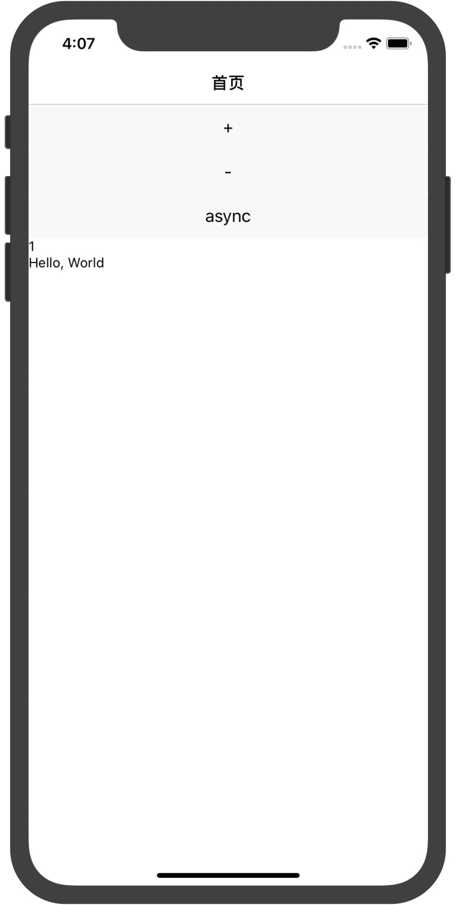

# taro-shell
taro最简单的shell，去掉官方那些expo里面的库


## 为什么？

taro中rn框架的目的是对标小程序的某些功能，使用的是expo这个库对应的内容。然而这些功能对于大部分项目来说都是没有必要的，即便是有，在rn中也有更好的替换，所以笔者认为，这部分内容不必要，索性就去掉了。

## 怎么实现的？

我们只要确保在taro项目中编译出来的rn项目在我们的原生项目中跑起来即可，也就是要使用我们自己实现的expo中的某些原生功能来替换掉原来的内容即可，这些功能非必要，只是让原先的项目跑起来，这样也可以起到减小项目体积的作用。


## 需要做什么?

对于原来的taro项目

```
npm run dev:rn
```

注意保留rn的cmd窗口,原生模块使用的是这里创建的服务窗口。

而对于shell项目
```
git clone https://github.com/jzoom/taro-shell
```

编译原生项目运行即可,不必使用这里的node_module




## 附录

ios编译问题

找不到"config.h"

https://www.jianshu.com/p/e51d5fabdf7e

"Unknown argument type '__attribute__' in method -[RCTAppState getCurrentAppState:error:]. Extend RCTConvert to support this type."

https://www.cnblogs.com/wtfu/p/11598566.html


